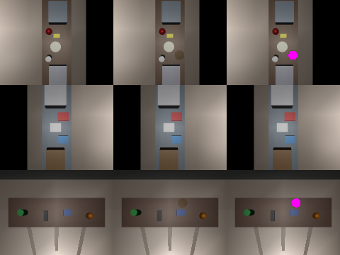

# The simulated home: 50 prompts (hand/home_tasks.py, tools/house.py --score)

The InMoov on its wheeled base in a kitchen / laundry / living room / you. Each prompt is planned, run on the body
model (reach, joint limits, grip, catches), and judged by where every object ends up.

| brain | passed | notes |
|---|---|---|
| rules only | **47/50** | direct jobs, wishes ("I'm hungry" -> apple), multi-step; judgement calls left open |
| rules + Qwen2.5-VL-3B 4-bit (laptop) | 47/50 | ~85 s per plan; the server died on the longer repair prompts |
| rules + Qwen2.5-3B text 4-bit (laptop), no examples | 47/50 | stable, 17-33 s per plan, no common sense: never wiped for "I spilled something" |
| same + its own solved tasks as in-context examples (fair) | 47/50 | plans reached for points 1-2 m away and couldn't repair them |
| same + 6 hand-written examples that paraphrase the tests (CEILING, not fair) | 48/50 | solved "get the dirty clothes out of the way" |
| **same, fair (own solved tasks as examples) + high-level skills only** | **49/50** | 27-68 s per plan; solved "belongs in the kitchen" and "dirty clothes"; "I spilled something" still never wipes |

The single change that mattered: the AI may only use skills (go, pick, put_in, put_on, give, wipe, ...), no raw hand
coordinates or joint angles, and it is told to think about where each object should end up first. With raw
coordinates available, the small model invented targets 1-2 m away and could not repair them.

Two more cheap levers (Kimi round 8), both prompt-only, no task-specific rules:

| change | passed | what happened |
|---|---|---|
| + one line per skill saying what it is for ("wipe: removes spills, crumbs, mess") | 48/50 | spill: picked up the remote and put it away, never wiped; "belongs in the kitchen" regressed (run-to-run noise on a 3B model) |
| + "what is wrong now / what should be true after" step before planning (`think(situate=True)`, off by default) | 48/50 | ~9 s extra per task. Spill: "wrong = the apple and ball on the living room counter" |

The situation step shows the real reason the spill fails: **the world description never contains a spill.** The robot
is told what objects are where, not that anything is dirty, so the model explains the request with what it can see
and tidies. A person would look at the floor. The fix is perception (camera / scene state reports messes), not a
smarter prompt. Rules only passes it because a rule maps "spill" to wipe. Scoring the AI on it is testing a guess.

So the world now has perceived messes (`HomeBody(m, messes={room: "..."})`, `SCENES` in home_tasks.py): the world text
lists "What the camera sees on the surfaces", and wipe clears the mess. The spill prompt's scene has "a sticky puddle
and some crumbs" on the living room table.

| change | passed | what happened |
|---|---|---|
| + perceived mess in the world text | 48/50 | the model now goes to the living room for the mess - and tries `pick crumbs` |
| + body check explains a failed grasp on a mess ("part of the mess on the surface, nothing solid to grasp") | 48/50 | same `pick crumbs` plan, **word for word, in all 3 rounds** |

Perception fixed the attention (it went to the right room, for the right reason). What's left is that the 3B model
does not use repair feedback: given the problem list it returns its first plan again. The body check, the repair loop
and the facts are all in place. A model that reads its own errors is the missing part.

**One-step repair** (Kimi round 9, `splice_repair` in home_tasks.py): instead of "rewrite the program", the failing step
gets a short list of replacements that were each run on the body first, and the model picks a number. Physics veto,
then the AI chooses - the grasp pipeline's pattern applied to plans. With a stand-in brain it turns the spill plan
into a wipe; **not yet measured with the real model** (the run was killed for low RAM).
Found on the way: the body labelled every pick/give/point error "step 1", so every repair prompt before this pointed the
model at the wrong step.

### Seeing the mess (hand/perceive.py)

The stain is no longer handed to the planner as text. Each counter has a camera looking straight down (RGB + depth).
The robot looks once at the clean house and remembers it; afterwards a mess is **a new hue at the same depth**:

- same depth: a stain is 3 mm thick, so the surface is where it was. Objects put down or picked up change depth and are
  ignored.
- new hue, not only new brightness: a shadow darkens the surface but keeps its r:g:b proportions; a spill changes them.
  Measured: stains shift hue by 13-35 (median, x255), shadows of moved objects by 4-10.

| test | result |
|---|---|
| clean house | nothing seen |
| stain on 1, 2 or all 3 counters | the right counters, "a dark stain about 9 cm across" (true diameter 9 cm) |
| each of the 11 objects moved 10 cm either way or lifted 0.5 m (33 moves) | 1 false stain: the sponge lifted 0.5 m above the counter |

The spill prompt now gets "living room surface: a dark stain about 9 cm across" from pixels. Wiping removes the decal.
Same rule on the real robot needs a depth camera and one "clean" snapshot per counter.

Also fixed: the house was built with `euler` in degrees but the InMoov model compiles angles in radians, so every counter
and container was drawn at a random-looking angle, with the objects floating next to it. Plans were never affected (the
arms use the room maths, not the drawn boxes), but the house tour looked wrong.

The 3 judgement calls: "put everything that belongs in the kitchen back in the kitchen", "get the dirty clothes out of
the way", "I spilled something in the living room".

What it means: the house, the skills and the body check all work; everything a rule can express is done. The part
that fails is the thinking, and the brain that fits a 6 GB laptop GPU is both slow (20-85 s per thought) and not
smart enough for judgement calls - which is the gap a bigger, faster brain is for.
